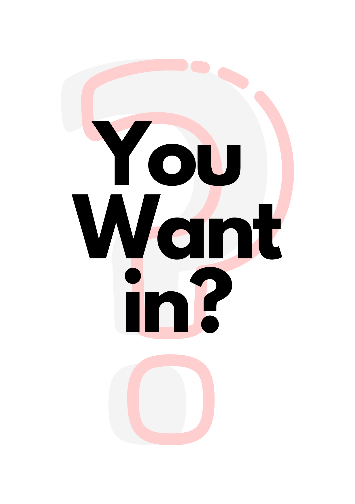

 

 <!--  -->
 
 
 

<h1>Heya Makers!</h1>

HUE is aimed to be a makerspace at NRTI, to promote "makers" philosophy. 
We also wish to test our mettle in various competitions around. 

  

<h3> Who are we ? </h3>

We are a group of people who can be easily spotted tinkering with stuff once you enter the lush NRTI campus. Our activities vary from experimenting with science and technology to exploring art to organizing fun outdoor activities (Seriously, take part in one of our treasure hunts and you will know!)

 

  

  <h3> How we work ?</h3>

  

Our focus is to build a community where people can teach and learn collaboratively. Suppose, you are interested in Data Mining/ Python/ any competition. Let's find out others who can teach you or maybe even compete with you. 

  

  

<h3> Membership ? </h3>

You don't need to be a member of the club to take part in or organize an activity. You can just sign up for the particular activity you are interested in and bring out your inner maker. 
However, to maintain this flexible structure, we do require a core team which can rigorously plan and execute these activities and we are always on a lookout. So, <a href="/contact/"> contact us </a> for becoming part of the core team.

 

By any chance, you interested? 
To know what the team is for, <a href="/hueloop/">check this out</a>
 
We would be releasing a form soon.
Keep checking. 
 
Also, you could subscribe to our <a href="http://eepurl.com/gXc91v">Newsletter</a>

