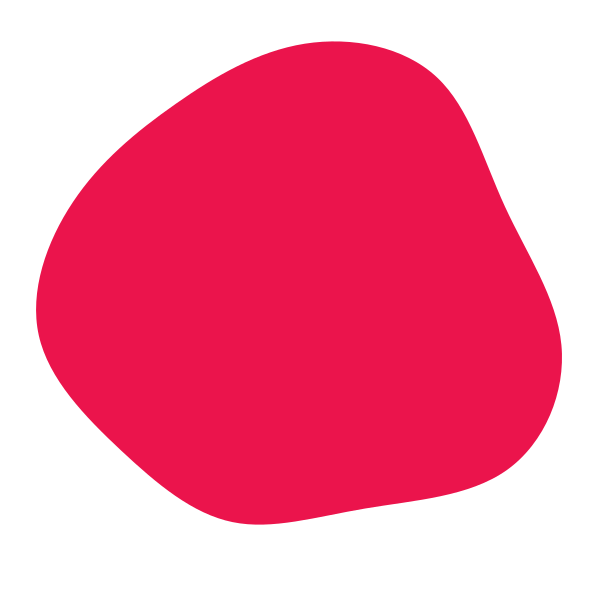
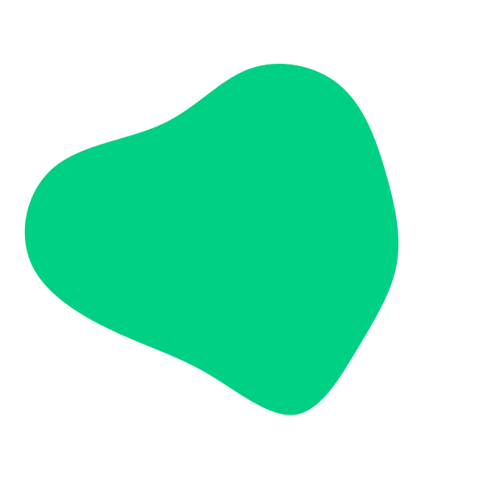

 

 <!--  -->
 
 

<h1>Heya Makers!</h1>

HUE is aimed to be a makerspace at NRTI, to promote "makers" philosophy. 
We also wish to test our mettle in various competitions around. 

 

By any chance, you interested? 
To know what the team is for, <a href="">check this out</a>
 
We would be releasing a form soon.
Keep checking. 
 
Also, you could subscribe to our newsletter here.
<a href="">Newsletter</a>

