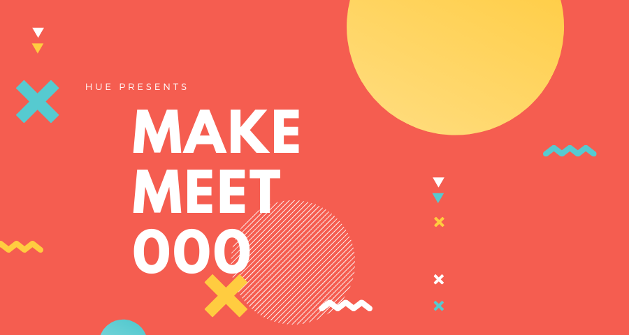
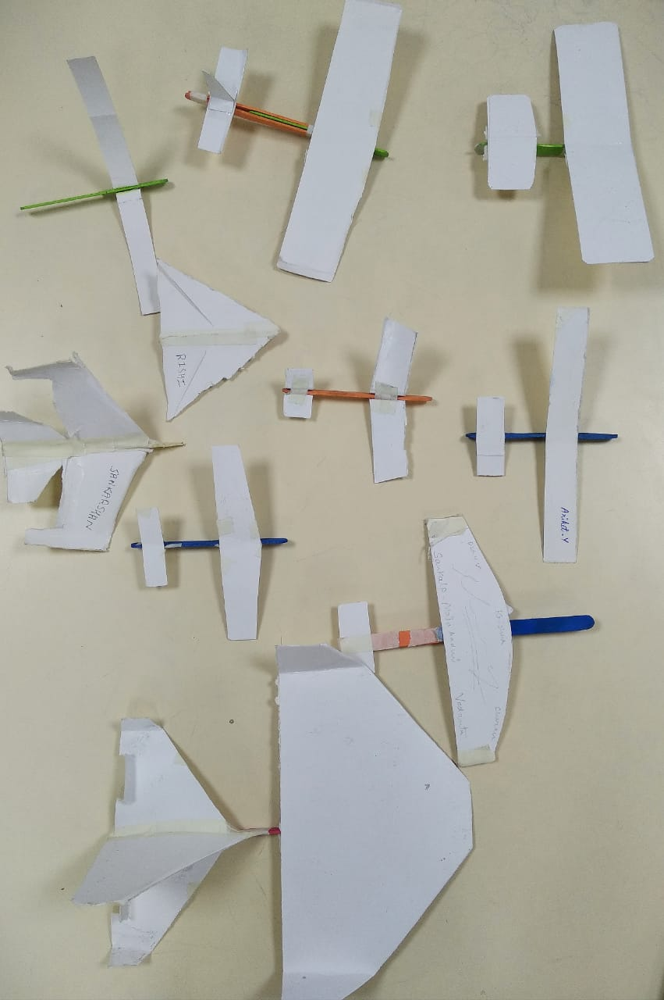

# Our First Makemeet
  
  The makemeet #000 was a short and sweet orientation activity that we held within the NRTI Campus. 

Aim of this meeting were 
- To introduce the Makers Club, the makers philosophy and the clubs purpose to the students
- To get started with a small fun activity and to teach how the smallest of the activities can be a very difficult task.

For the activity, we hadd everyone to build a popsicle paper plane glider. And then conduct a race. 

The plan started out well. Everyone had made up a model within 20 mins. Then was the time to test it. They tested the models. 

And models failed.

Back to drawingboard -> New model -> Test -> Fail

This process went on for around one more hour. Which was the time for the team to wrap-up. 

While none of the gliders was able to achieve flight, everyone did have fun, and learnt something about the aspect ratio, the aerofoil design, the angle of attack etc.

Or not.
